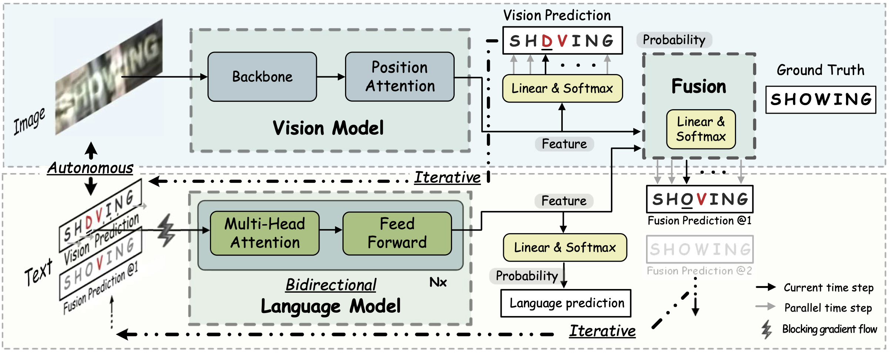

# Read Like Humans: Autonomous, Bidirectional and Iterative Language Modeling for Scene Text Recognition

The unofficial code of [ABINet](https://arxiv.org/pdf/2103.06495.pdf) (CVPR 2021, Oral).

ABINet uses a vision model and an explicit language model to recognize text in the wild, which are trained in end-to-end way. The language model (BCN) achieves bidirectional language representation in simulating cloze test, additionally utilizing iterative correction strategy.



## Runtime Environment

- We provide a pre-built docker image using the Dockerfile from `docker/Dockerfile`

- Running in Docker
    ```
    $ git@github.com:FangShancheng/ABINet.git
    $ docker run --gpus all --rm -ti --ipc=host -v "$(pwd)"/ABINet:/app fangshancheng/fastai:torch1.1 /bin/bash
    ```
- (Untested) Or using the dependencies
    ```
    pip install -r requirements.txt
    ```

## Lightning (Hydra + W&B) Training  *recommended*

- Install deps with uv (pyproject/uv.lock を利用):
  ```
  uv sync
  ```
- 利用可能なoptimizerについては [`docs/optimizers.md`](docs/optimizers.md) を参照してください
- Launch training with PyTorch Lightning + Hydra + Weights & Biases:
  ```
  uv run python train_lightning.py config_path=configs/train_abinet.yaml \
      trainer.max_epochs=10 \
      wandb.enable=true wandb.project=abinet wandb.mode=online
  ```
  - 既存の設定は `config_path` で従来YAMLを読み込み、Hydra オーバーライドで `trainer.*` / `wandb.*` を上書きできます。
  - `wandb.mode` は `online` / `offline` / `disabled` を選択可。W&B を使わない場合は `wandb.enable=false`。
- 学習と検証は Lightning の `Trainer` に統一されています。チェックポイントは `abinet-{epoch:02d}-{val_cwr:.4f}.ckpt` で保存されます。
- Lightning 実行では `torch.compile` が既定で有効です。無効化する場合は `runtime.compile_enabled=false`。
- Transformer 内の multi-head attention は PyTorch 2.x の SDPA を使用します。`runtime.attention_backend` で `auto` / `flash_only` / `math_only` を選べます。
- FlashAttention カーネルを優先したい場合は mixed precision が必要です。例えば `trainer.precision=bf16-mixed` を指定してください。
- decoder 側で `attn_mask` を使う経路では FlashAttention カーネルが使えない場合があります。そのため通常は `flash_only` ではなく `auto` の使用を推奨します。

### 実行例（くずし字 Kuzushiji）

1. 列ボックス＋文字列ラベルで LMDB を作成  
   ```
   uv run python tools/build_kuzushiji_column_lmdb.py \
     --column-root datasets/kuzushiji-column \
     --raw-root datasets/raw/dataset \
     --output-root data/kuzushiji_column_lmdb \
     --margin 4
   ```
2. Vision 事前学習（Lightning）  
   ```
   uv run python train_lightning.py \
     --config-name lightning_vision \
     config_path=configs/pretrain_vision_kuzushiji.yaml \
     trainer.max_epochs=null \
     wandb.enable=true wandb.project=abinet-kuzushiji-vision
   ```
3. Language 事前学習（Lightning）  
   ```
   uv run python train_lightning.py \
     --config-name lightning_language \
     config_path=configs/pretrain_language_model.yaml \
     trainer.max_epochs=null \
     wandb.enable=true wandb.project=abinet-kuzushiji-language
   ```
   
   Hugging Faceデータセットを使用する場合:
   ```
   uv run python train_lightning.py \
     --config-name lightning_language_huggingface \
     config_path=configs/pretrain_language_model_huggingface.yaml \
     trainer.max_epochs=null \
     wandb.enable=true wandb.project=abinet-kuzushiji-language
   ```
   
   Schedule-Free Optimizer (RAdamScheduleFree) を使用する場合:
   ```
   uv run python train_lightning.py \
     --config-name lightning_language_huggingface \
     config_path=configs/pretrain_language_model_huggingface_schedulefree.yaml \
     trainer.max_epochs=null \
     wandb.enable=true wandb.project=abinet-kuzushiji-language
   ```
4. 本学習（事前学習ckptを設定した上で）  
   ```
   uv run python train_lightning.py \
     config_path=configs/train_abinet_kuzushiji.yaml \
     --config-name=lightning \
     trainer.max_epochs=10 \
     wandb.enable=true wandb.project=abinet-kuzushiji
   ```

### 実行例（`datasets` の NDL-MinHon OCR Dataset）

このリポジトリでは、`datasets` が NDL-MinHon OCR Dataset に向いていれば、そのまま ABINet 学習用 LMDB に変換できます。

対応するデータ構成:
```
datasets
├── v2/<corpus>/<doc_id>/<page>.json
├── img_v2/<corpus>/<doc_id>/<page>.jpg
├── v1/<doc_id>/<page>.json
└── img_v1/<doc_id>/<page>.jpg
```

- `v2` は `words[*].boundingBox` と `words[*].text` を利用
- `v1` は JSON 配列の各要素の `boundingBox` と `text` を利用
- `isTextline=true` の要素だけを使い、bbox でページ画像から列領域をクロップ
- `train/val/test` split が無いので、文書単位で `train/val/test` に自動分割
- 画像が欠けているページは自動でスキップ

必要なら従来の `train/images + labels.*` 形式も引き続きサポートしています。

1. LMDB と charset を生成  
   ```
   uv run python tools/build_classical_column_lmdb.py \
     --dataset-root datasets \
     --output-root data/japanese_classical_column_lmdb \
     --source-format auto \
     --max-length 40 \
     --val-ratio 0.1 \
     --test-ratio 0.1 \
     --margin 4 \
     --num-workers 8
   ```
   `v2` の特定コーパスだけ使う場合:
   ```
   uv run python tools/build_classical_column_lmdb.py \
     --dataset-root datasets \
     --source-format ndl-minhon-v2 \
     --corpora tempo kamosha ibarakiuniv \
     --output-root data/japanese_classical_column_lmdb
   ```
2. Vision 事前学習  
   ```
   uv run python train_lightning.py \
     --config-name lightning_vision \
     config_path=configs/pretrain_vision_japanese_classical.yaml \
     trainer.max_epochs=10 \
     wandb.enable=false
   ```
   古典籍向け既定値では、縦長列画像をデータ読み込み時に反時計回り 90 度回転し、比率保持リサイズを使います。
   `64x256` の比較用設定:
   ```
   uv run python train_lightning.py \
     --config-name lightning_vision \
     config_path=configs/pretrain_vision_japanese_classical_64x256.yaml \
     trainer.max_epochs=10 \
     wandb.enable=false
   ```
3. Language 事前学習用 TSV を生成  
   ```
   uv run python tools/create_language_corpus_from_lmdb.py \
     --train-lmdb data/japanese_classical_column_lmdb/train \
     --val-lmdb data/japanese_classical_column_lmdb/val \
     --output-train data/japanese_classical_language_train.tsv \
     --output-val data/japanese_classical_language_val.tsv \
     --dedupe
   ```
4. Language 事前学習  
   ```
   uv run python train_lightning.py \
     --config-name lightning_language \
     config_path=configs/pretrain_language_model_japanese_classical.yaml \
     trainer.max_epochs=40 \
     wandb.enable=false
   ```
5. ABINet 本学習  
   ```
   uv run python train_lightning.py \
     --config-name lightning \
     config_path=configs/train_abinet_japanese_classical.yaml \
     trainer.max_epochs=10 \
     model.vision.checkpoint=/path/to/pretrain_vision.ckpt \
     model.language.checkpoint=/path/to/pretrain_language.ckpt \
     wandb.enable=false
   ```
   古典籍向け本学習 config は pretrained checkpoint の指定を必須にしています。未指定なら fail-fast します。
   `64x256` 設定を使う場合:
   ```
   uv run python train_lightning.py \
     --config-name lightning \
     config_path=configs/train_abinet_japanese_classical_64x256.yaml \
     trainer.max_epochs=10 \
     model.vision.checkpoint=/path/to/pretrain_vision.ckpt \
     model.language.checkpoint=/path/to/pretrain_language.ckpt \
     wandb.enable=false
   ```
   `64x384` 設定を明示的に使う場合:
   ```
   uv run python train_lightning.py \
     --config-name lightning \
     config_path=configs/train_abinet_japanese_classical_64x384.yaml \
     trainer.max_epochs=10 \
     model.vision.checkpoint=/path/to/pretrain_vision.ckpt \
     model.language.checkpoint=/path/to/pretrain_language.ckpt \
     wandb.enable=false
   ```

## Datasets

- Training datasets

    1. [MJSynth](http://www.robots.ox.ac.uk/~vgg/data/text/) (MJ): 
        - Use `tools/create_lmdb_dataset.py` to convert images into LMDB dataset
        - [LMDB dataset BaiduNetdisk(passwd:n23k)](https://pan.baidu.com/s/1mgnTiyoR8f6Cm655rFI4HQ)
    2. [SynthText](http://www.robots.ox.ac.uk/~vgg/data/scenetext/) (ST):
        - Use `tools/crop_by_word_bb.py` to crop images from original [SynthText](http://www.robots.ox.ac.uk/~vgg/data/scenetext/) dataset, and convert images into LMDB dataset by `tools/create_lmdb_dataset.py`
        - [LMDB dataset BaiduNetdisk(passwd:n23k)](https://pan.baidu.com/s/1mgnTiyoR8f6Cm655rFI4HQ)
    3. [WikiText103](https://s3.amazonaws.com/research.metamind.io/wikitext/wikitext-103-v1.zip), which is only used for pre-trainig language models:
        - Use `notebooks/prepare_wikitext103.ipynb` to convert text into CSV format.
        - [CSV dataset BaiduNetdisk(passwd:dk01)](https://pan.baidu.com/s/1yabtnPYDKqhBb_Ie9PGFXA)
    4. Hugging Faceデータセット（言語モデル事前学習用）:
        - `Kotomiya07/honkoku-hq` や `Kotomiya07/honkoku-v3.0` などのHugging Face Hubのデータセットを直接使用可能
        - 設定ファイルで `dataset.huggingface_train` と `dataset.huggingface_test` を指定することで使用可能
        - 詳細は `configs/pretrain_language_model_huggingface.yaml` を参照
        - 古文書データセットから文字セットを自動生成:
          ```bash
          uv run python tools/create_charset_from_huggingface.py \
            --dataset-names Kotomiya07/honkoku-hq Kotomiya07/honkoku-v3.0 \
            --text-column text \
            --output data/kuzushiji_column_lmdb/charset_kuzushiji_column.txt \
            --splits train validation
          ```

- Evaluation datasets, LMDB datasets can be downloaded from [BaiduNetdisk(passwd:1dbv)](https://pan.baidu.com/s/1RUg3Akwp7n8kZYJ55rU5LQ), [GoogleDrive](https://drive.google.com/file/d/1dTI0ipu14Q1uuK4s4z32DqbqF3dJPdkk/view?usp=sharing).
    1. ICDAR 2013 (IC13)
    2. ICDAR 2015 (IC15)
    3. IIIT5K Words (IIIT)
    4. Street View Text (SVT)
    5. Street View Text-Perspective (SVTP)
    6. CUTE80 (CUTE)


- The structure of `data` directory is
    ```
    data
    ├── charset_36.txt
    ├── evaluation
    │   ├── CUTE80
    │   ├── IC13_857
    │   ├── IC15_1811
    │   ├── IIIT5k_3000
    │   ├── SVT
    │   └── SVTP
    ├── training
    │   ├── MJ
    │   │   ├── MJ_test
    │   │   ├── MJ_train
    │   │   └── MJ_valid
    │   └── ST
    ├── WikiText-103.csv
    └── WikiText-103_eval_d1.csv
    ```

### Pretrained Models

Get the pretrained models from [BaiduNetdisk(passwd:kwck)](https://pan.baidu.com/s/1b3vyvPwvh_75FkPlp87czQ), [GoogleDrive](https://drive.google.com/file/d/1mYM_26qHUom_5NU7iutHneB_KHlLjL5y/view?usp=sharing). Performances of the pretrained models are summaried as follows:

|Model|IC13|SVT|IIIT|IC15|SVTP|CUTE|AVG|
|-|-|-|-|-|-|-|-|
|ABINet-SV|97.1|92.7|95.2|84.0|86.7|88.5|91.4|
|ABINet-LV|97.0|93.4|96.4|85.9|89.5|89.2|92.7|

## Training  (fastai legacy pipeline)

1. Pre-train vision model
    ```
    CUDA_VISIBLE_DEVICES=0,1,2,3 python main.py --config=configs/pretrain_vision_model.yaml
    ```
2. Pre-train language model
    ```
    CUDA_VISIBLE_DEVICES=0,1,2,3 python main.py --config=configs/pretrain_language_model.yaml
    ```
3. Train ABINet
    ```
    CUDA_VISIBLE_DEVICES=0,1,2,3 python main.py --config=configs/train_abinet.yaml
    ```
Note:
- You can set the `checkpoint` path for vision and language models separately for specific pretrained model, or set to `None` to train from scratch


## Evaluation

```
CUDA_VISIBLE_DEVICES=0 python main.py --config=configs/train_abinet.yaml --phase test --image_only
```
Additional flags:
- `--checkpoint /path/to/checkpoint` set the path of evaluation model 
- `--test_root /path/to/dataset` set the path of evaluation dataset
- `--model_eval [alignment|vision]` which sub-model to evaluate
- `--image_only` disable dumping visualization of attention masks

## Web Demo

Integrated into [Huggingface Spaces 🤗](https://huggingface.co/spaces) using [Gradio](https://github.com/gradio-app/gradio). Try out the Web Demo: [](https://huggingface.co/spaces/tomofi/ABINet-OCR)

## Run Demo

```
python demo.py --config=configs/train_abinet.yaml --input=figs/test
```
Additional flags:
- `--config /path/to/config` set the path of configuration file 
- `--input /path/to/image-directory` set the path of image directory or wildcard path, e.g, `--input='figs/test/*.png'`
- `--checkpoint /path/to/checkpoint` set the path of trained model
- `--cuda [-1|0|1|2|3...]` set the cuda id, by default -1 is set and stands for cpu
- `--model_eval [alignment|vision]` which sub-model to use
- `--image_only` disable dumping visualization of attention masks

## Visualization
Successful and failure cases on low-quality images:


## Citation
If you find our method useful for your reserach, please cite
```bash 
@article{fang2021read,
  title={Read Like Humans: Autonomous, Bidirectional and Iterative Language Modeling for Scene Text Recognition},
  author={Fang, Shancheng and Xie, Hongtao and Wang, Yuxin and Mao, Zhendong and Zhang, Yongdong},
    booktitle={Proceedings of the IEEE/CVF Conference on Computer Vision and Pattern Recognition},
  year={2021}
}
 ```

 ## License

This project is only free for academic research purposes, licensed under the 2-clause BSD License - see the LICENSE file for details.

Feel free to contact fangsc@ustc.edu.cn if you have any questions.
